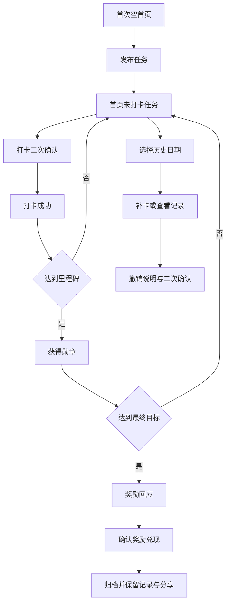

# 天天打卡 产品开发交付文档

> 文档状态：V1.1 产品规格的正式实现交付说明  
> 更新日期：2026-07-28
> 代码版本：1.2.4
> 产品形态：面向家长和中小学生的本地优先离线 PWA

## 1. 产品目标

家长创建可长期坚持的学习任务，孩子每天完成后打卡，通过勋章注水、里程碑点亮和家长兑现奖励获得明确反馈。产品首先解决“坚持过程没有反馈、微信群文字打卡缺少爽感”的问题。

V1.1 不做账号、云同步、照片证明、排行榜、成长等级和社交关系。数据只保存在当前设备。

## 2. 视觉基准

Figma 文件：[天天打卡](https://www.figma.com/design/fms7qDu4GjPsyWlEXG5tnh/%E5%A4%A9%E5%A4%A9%E6%89%93%E5%8D%A1?node-id=106-71)

正式 UI 区为节点 `179:1453`，包含以下 13 个开发画板：

| 页面 | Figma 节点 | 基准尺寸 |
| --- | --- | --- |
| 首次空首页 | `147:89` | 393 x 851 |
| 打卡首页 | `106:124` | 393 x 851 |
| 打卡二次确认 | `151:1226` | 393 x 851 |
| 打卡成功 | `112:1818` | 393 x 851 |
| 获得勋章 | `179:1460` | 393 x 851 |
| 发布任务 | `147:491` | 393 x 852 |
| 编辑任务 | `149:933` | 393 x 852 |
| 我的勋章 | `147:662` | 393 x 850 |
| 个人信息 | `179:1909` | 393 x 852 |
| 打卡记录 | `153:451` | 393 x 852 |
| 撤销说明 | `156:821` | 393 x 852 |
| 奖励回应 | `156:991` | 393 x 852 |
| 分享 | `172:1800` | 393 x 850 |

实现必须使用 Figma 原始层级、图标、位图、间距、字体、颜色、圆角和阴影。禁止使用字符符号代替图标。393px 宽度做 1:1 验收，360px 和桌面做响应式适配。

## 3. 首次使用

首次打开直接进入空首页，不弹出个人信息表单：

- 默认昵称为“小天天”。
- 累计坚持为 0 天。
- 本周轨迹没有历史打卡对勾。
- 今日任务显示“未发布”和空任务卡。
- 点击“新建任务”进入发布任务页。
- 个人信息从“我的勋章”页面进入并编辑。

开发、测试和正式体验数据使用不同存储键。交付前必须清除正式体验数据，禁止携带测试打卡记录。

## 4. 日期切换

- 本周 7 个日期节点都是可点击按钮。
- 默认选中今天，显示今天的任务状态。
- 点击过去日期后，日期节点进入选中态，任务区域切换到该目标日期。
- 标题显示“今日任务”或“X月X日任务”。
- 历史日期已有有效打卡时显示完成状态；没有记录时显示未打卡状态和补卡入口。
- 未来日期只允许查看，不允许打卡或补卡。
- 展开后显示本月日历；月历日期也能选择，规则与周视图一致。

## 5. 核心规则

- 任务名称最多 20 个字符，奖励最多 20 个字符。
- 同时最多存在 10 个未归档任务。
- 目标天数仅支持 7、14、21、30 天。
- 直接打卡只记录今天，同一任务同一日期只允许一条有效记录。
- 补卡仅支持过去日期，必须填写最多 100 字原因并二次确认。
- 撤销必须填写最多 100 字原因并二次确认。
- 撤销同步回退任务进度和勋章注水，已点亮勋章允许回灰。
- 任务状态为 `active -> completed -> archived`。
- 达成目标后由家长确认奖励已兑现，确认后任务归档。
- 归档任务从首页移除，历史记录、勋章和分享能力保留且只读。
- 全局累计坚持天数按有效打卡自然日去重，超过 999 显示 `999+`。

## 6. 页面流程

## 7. 技术结构

- `index.html`：应用入口、PWA 元信息。
- `styles.css`：Figma 设计令牌、响应式布局和动效。
- `app.js`：页面渲染、路由状态和交互。
- `core.mjs`：纯数据规则，不依赖 DOM。
- `assets/figma/`：从 Figma 导出的正式 SVG/PNG。
- `assets/fonts/`：阿里巴巴普惠体 2.0。
- `manifest.webmanifest`、`sw.js`：安装和离线缓存。
- `tests/core.test.mjs`：业务规则测试。
- `tests/ui/`：浏览器核心流程和视觉基线说明。

不引入后端和账号系统。静态文件可以直接部署到 GitHub Pages。

## 8. 手机与桌面显示

- 移动浏览器以设备宽度显示，内容最大宽度 393px。
- 普通浏览器中显示动态模拟状态栏，时间使用当前设备时间。
- PWA 独立模式使用安全区，避免模拟状态栏与系统状态栏重复。
- 桌面端将 393px 产品画面居中展示，背景不参与产品 UI 设计。
- 底部导航固定在产品视口底部，并处理 `safe-area-inset-bottom`。

## 9. 离线、安装与分享

首次联网打开后，Service Worker 缓存应用壳和全部本地素材。断网后仍可创建任务、打卡、补卡、撤销和查看记录。

GitHub Pages 发布后：

1. 朋友用微信或系统浏览器打开 HTTPS 链接。
2. iPhone 使用 Safari 的“添加到主屏幕”。
3. Android 使用 Chrome 的“安装应用”或“添加到主屏幕”。
4. 每台设备独立保存数据，卸载或清理浏览器数据会删除本地记录。

## 10. 验收标准

- 首次打开无历史打卡数据。
- 13 个关键页面与对应 Figma 截图逐页比对。
- 393 x 851/852 截图对比布局、字体、颜色、图标、阴影和间距。
- 360px 无水平溢出、遮挡或文字截断。
- 周视图和月视图日期可切换，并正确更新任务状态。
- 完整流程通过：新建任务、打卡、补卡、撤销、里程碑、奖励、归档、分享。
- 刷新后数据保留，离线重载成功。
- 控制台无应用错误和缺失资源。
- GitHub 仓库文件完整，GitHub Pages 可以公开访问。

## 11. 发布信息

- GitHub：`GZ-gu/tiantian-checkin`
- 部署：GitHub Pages，推送 `main` 后由 Actions 自动发布
- 本地启动：在项目目录运行 `python3 -m http.server 4185 --bind 127.0.0.1`
- 本地地址：`http://127.0.0.1:4185/`

## 12. 已完成验收

- 规则测试：10 项全部通过。
- 360 x 800：空首页、新建任务、直接打卡、成功页，无水平溢出或控制台错误。
- 393 x 851：历史日期切换、补卡、撤销、记录追溯、分享海报、奖励归档，无水平溢出或控制台错误。
- 离线：Service Worker 接管后断网刷新成功，任务、进度、字体和图片均可读取。
- 正式存储键：`tiantian-checkin-v1.2-production`；旧版数据不会污染首次体验。
