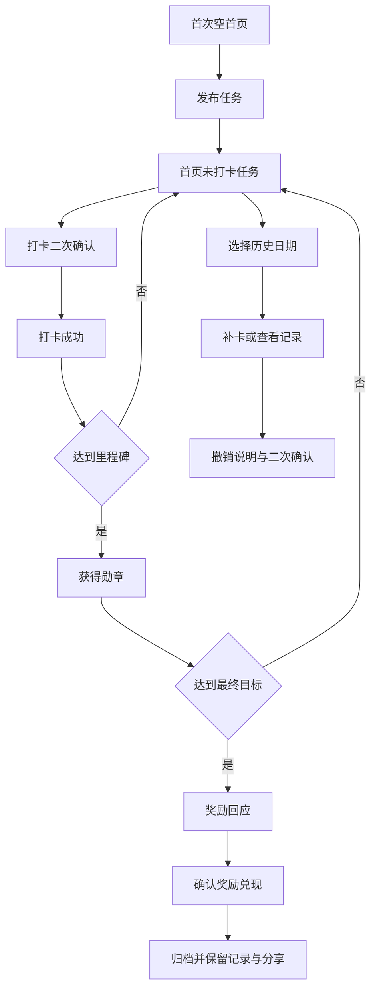

# 天天打卡 产品开发交付文档

> 文档状态：V1.1 产品规格的正式实现交付说明  
> 更新日期：2026-08-14
> 代码版本：1.2.21
> 产品形态：面向家长和中小学生的本地优先离线 PWA

## 1. 产品目标

家长创建可长期坚持的学习任务，孩子每天完成后打卡，通过勋章注水、里程碑点亮和家长兑现奖励获得明确反馈。产品首先解决“坚持过程没有反馈、微信群文字打卡缺少爽感”的问题。

V1.1 不做账号、云同步、照片证明、排行榜、成长等级和社交关系。数据只保存在当前设备。

## 2. 视觉基准

Figma 文件：[天天打卡](https://www.figma.com/design/fms7qDu4GjPsyWlEXG5tnh/%E5%A4%A9%E5%A4%A9%E6%89%93%E5%8D%A1?node-id=106-71)

正式 UI 区为节点 `179:1453`。开发验收覆盖 13 个主流程画板和首次空首页，共 14 个页面/状态：

| 页面 | Figma 节点 | 基准尺寸 |
| --- | --- | --- |
| 首次空首页 | `189:2370` | 393 x 851 |
| 打卡首页 | `106:124` | 393 x 851 |
| 展开成长轨迹 | `189:2645` | 393 x 851 |
| 打卡二次确认 | `151:1226` | 393 x 851 |
| 打卡成功 | `112:1818` | 393 x 851 |
| 获得勋章 | `179:1460` | 393 x 851 |
| 发布任务 | `147:491` | 393 x 852 |
| 编辑任务 | `149:933` | 393 x 852 |
| 我的勋章 | `147:662` | 393 x 850 |
| 个人信息 | `179:1909` | 393 x 852 |
| 打卡记录 | `153:451` | 393 x 852 |
| 撤销说明 | `156:821` | 393 x 852 |
| 奖励回应 | `156:991` | 393 x 852 |
| 分享 | `172:1800` | 393 x 850 |

实现必须使用 Figma 原始层级、图标、位图、间距、字体、颜色、圆角和阴影。禁止使用字符符号代替图标。393px 宽度做 1:1 验收，360px 和桌面做响应式适配。

## 3. 首次使用

首次打开直接进入空首页，不弹出个人信息表单：

- 默认昵称为“小天天”。
- 累计坚持为 0 天。
- 本周轨迹没有历史打卡对勾。
- 今日任务显示“未发布”和空任务卡。
- 点击“新建任务”进入发布任务页。
- 个人信息从“我的勋章”页面进入并编辑。

开发、测试和正式体验数据使用不同存储键。交付前必须清除正式体验数据，禁止携带测试打卡记录。

## 4. 日期切换

- 本周 7 个日期节点都是可点击按钮。
- 默认选中今天，显示今天的任务状态。
- 点击过去日期后，日期节点进入选中态，任务区域切换到该目标日期。
- 标题显示“今日任务”或“X月X日任务”。
- 历史日期已有有效打卡时显示完成状态；没有记录时显示未打卡状态和补卡入口。
- 同一天存在多个任务时，只有全部任务都有有效打卡，该日期才显示完成对勾；撤销任一任务后回退为待补卡状态。
- 未来日期只允许查看，不允许打卡或补卡。
- 展开后显示本月日历；月历日期也能选择，规则与周视图一致。

## 5. 核心规则

- 任务名称最多 20 个字符，奖励最多 20 个字符。
- 同时最多存在 10 个未归档任务。
- 目标天数仅支持 7、14、21、30 天。
- 直接打卡只记录今天，同一任务同一日期只允许一条有效记录。
- 补卡仅支持过去日期，必须填写最多 100 字原因并二次确认。
- 撤销必须填写最多 100 字原因并二次确认。
- 撤销同步回退任务进度和勋章注水，已点亮勋章允许回灰。
- 任务状态为 `active -> completed -> archived`。
- 达成目标后由家长确认奖励已兑现，确认后任务归档。
- 归档任务从首页移除，历史记录、勋章和分享能力保留且只读。
- 全局累计坚持天数按有效打卡自然日去重，超过 999 显示 `999+`。

## 6. 页面流程

## 7. 技术结构

- `index.html`：应用入口、PWA 元信息。
- `styles.css`：Figma 设计令牌、响应式布局和动效。
- `app.js`：页面渲染、路由状态和交互。
- `core.mjs`：纯数据规则，不依赖 DOM。
- `assets/figma/`：从 Figma 导出的正式 SVG/PNG。
- `assets/figma/confetti.svg`：Figma 导出的可循环 Confetti 完整喷射动效。
- `assets/fonts/`：阿里巴巴普惠体 2.0。
- `manifest.webmanifest`、`sw.js`：安装和离线缓存。
- `tests/core.test.mjs`：业务规则测试。
- `docs/figma-baseline/`：Figma源图、两套视口截图、差异图和验收报告。

不引入后端和账号系统。静态文件可以直接部署到 GitHub Pages。

## 8. 手机与桌面显示

- 移动浏览器以设备宽度显示，内容最大宽度 393px。
- 所有页面均不渲染模拟时间、信号、Wi-Fi 和电池状态栏，以真实手机系统状态栏为准。
- 页面顶部布局已去除原模拟状态栏占用的 50px 空间，浏览器和 PWA 均不会出现双状态栏。
- 桌面端将 393px 产品画面居中展示，背景不参与产品 UI 设计。
- 底部导航固定在产品视口底部，并处理 `safe-area-inset-bottom`。

## 9. 离线、安装与分享

首次联网打开后，Service Worker 缓存应用壳和全部本地素材。断网后仍可创建任务、打卡、补卡、撤销和查看记录。

GitHub Pages 发布后：

1. 朋友用微信或系统浏览器打开 HTTPS 链接。
2. iPhone 使用 Safari 的“添加到主屏幕”。
3. Android 使用 Chrome 的“安装应用”或“添加到主屏幕”。
4. 每台设备独立保存数据，卸载或清理浏览器数据会删除本地记录。

## 10. 验收标准

- 首次打开无历史打卡数据。
- 14 个关键页面/状态与对应 Figma 截图逐页比对。
- 393 x 851/852 截图对比布局、字体、颜色、图标、阴影和间距。
- 360px 无水平溢出、遮挡或文字截断。
- 周视图和月视图日期可切换，并正确更新任务状态。
- 完整流程通过：新建任务、打卡、补卡、撤销、里程碑、奖励、归档、分享。
- 刷新后数据保留，离线重载成功。
- 控制台无应用错误和缺失资源。
- GitHub 仓库文件完整，GitHub Pages 可以公开访问。

## 11. 发布信息

- GitHub：`GZ-gu/tiantian-checkin`
- 部署：GitHub Pages，推送 `main` 后由 Actions 自动发布
- 在线体验：`https://gz-gu.github.io/tiantian-checkin/`
- 正式功能提交：`a1441ea`（循环源动效与海报构图校准）
- 当前发布版本：`1.2.21`（PWA 安全区背景回归修复）
- 本地启动：在项目目录运行 `python3 -m http.server 4186 --bind 127.0.0.1`
- 本地地址：`http://127.0.0.1:4186/`

## 12. 已完成验收

- 规则测试：`13/13` 通过，`app.js` 和 `sw.js` 语法检查通过。
- 360 x 800：14 个页面/状态完成真实浏览器截图，页面宽度为 360px，无横向溢出、右侧裁切或底栏遮挡。
- 393 x 851：14 个页面/状态完成Figma逐页对照，computed font-family为 `Alibaba PuHuiTi 2.0`，无横向溢出。
- 完整交互：直接打卡、补卡原因、二次确认、撤销原因、进度回退、奖励兑现、任务归档和海报保存均通过。
- 海报：预览与导出一致，实际生成 `702 x 1194` RGBA PNG。
- 本轮海报：以 Figma 节点 `172:1800` 为源，使用对应的木纹 SVG、棕色保存图标和水平翻转的小狮子；木纹节点预览 5 个、页脚纹理节点 4 个。
- 打卡成功动效：使用 Figma 原始 `confetti.svg` 的持续循环动作，直到离开成功页；减少动效模式不播放。
- 离线：停止本地HTTP服务后刷新成功，任务进度、字体和20个抽查图片均可读取；恢复服务后数据保留。
- 正式存储键：`tiantian-checkin-v1.2-production`；旧版数据不会污染首次体验。

## 13. 1.2.19 修复验收

- 弹窗小狮子使用 Figma 节点 `192:3242` 的原始透明图片，导出后四角 Alpha 为 0，不再包含白色方底。
- 补卡原因输入字号调整为 16px，避免 iPhone Safari 输入后自动缩放页面；通用确认弹窗增加移动端宽度和长文本防溢出约束。
- 打卡确认提示在 393 x 851 和 360 x 800 下均保持单行，图标与文字中心对齐。
- 所有页面移除模拟状态栏，并同步上移顶部内容 50px。
- 成功页外圆环、内圆环和勋章改为同一中心布局；两个验收视口下三者中心坐标完全一致。
- 393 x 851 与 360 x 800 均完成打卡确认、长补卡原因二次确认和打卡成功页截图，见 `docs/figma-baseline/qa-1.2.19/`。
- 浏览器完成直接打卡、补卡、撤销和取消操作回归；包含 2 个任务、4 条打卡记录的本地数据刷新后完整保留。
- `STORAGE_KEY` 和版本 2 数据结构没有修改，`core.mjs` 业务规则没有修改。

## 14. 1.2.20 PWA 安装态校准

- iOS PWA 状态栏改为透明模式，顶部安全区由首页黄色背景承接，页面内容仍从安全区下方开始。
- 底部导航取消重复叠加 `safe-area-inset-bottom`，恢复为距视口底部 26px。
- 桌面图标由根目录 `手机桌面图标.png` 生成 192px 和 512px 标准资源。
- `STORAGE_KEY`、版本 2 数据结构和 `core.mjs` 业务规则均未修改。

## 15. 1.2.21 安全区背景修复

- 应用容器恢复为页面浅灰底色，修复所有页面底部空白区域变成黄色的问题。
- 黄色仅覆盖 iOS 顶部安全区，各页面原有头图、主体和底部背景保持设计稿颜色。
- 底部导航继续使用 Figma 节点 `149:613` 对应的 26px 底部间距。
- `STORAGE_KEY`、版本 2 数据结构和 `core.mjs` 业务规则均未修改。
