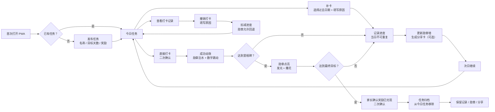

# 天天打卡 V1.1 PRD

> 文档状态：开发基线  
> 版本：V1.1  
> 产品名称：天天打卡  
> 更新日期：2026-08-02
> 目标：先完成本地可运行、支持离线体验的 PWA MVP

## 0. 本版本结论

### 0.1 一句话定位

“天天打卡”是一款帮助家长把孩子每天的学习坚持变成可见成就的轻量工具：创建任务、直接打卡、勋章成长、奖励回应。

### 0.2 第一性原理

孩子持续学习不只是因为任务被发布，而是因为每次完成后都能立刻感知到“我又完成了一点”，并且长期积累能被孩子和家长看见。

因此 V1.1 只验证一个核心假设：

> 孩子是否会因为“打卡成功反馈 + 勋章成长 + 家长奖励回应”，愿意连续使用 7 天。

### 0.3 相比上一版的收敛

- 产品名称统一为“天天打卡”。
- 第一版支持“直接打卡”和“补卡”；补卡可选择任意历史日期，必须填写补卡原因。
- 不做照片上传、文字说明和学习质量判断。
- 不做账号、家庭成员绑定、云同步和排行榜。
- 不做等级/经验系统，勋章里程碑已经承担成长反馈。
- 重点投入打卡成功动效、勋章注水和奖励兑现闭环。
- 采用本地存储 + 离线 PWA，先用于本地和小范围体验。

## 1. 产品目标与非目标

### 1.1 V1.1 目标

1. 家长可以在 1 分钟内创建一个每日任务。
2. 孩子可以在 10 秒内完成一次直接打卡。
3. 打卡后立即看到进度、勋章和微小庆祝反馈。
4. 家长可以看到任务进度，并确认约定奖励是否兑现。
5. 用户关闭网络后，已经打开过的 PWA 仍可继续使用。
6. 用户可以生成一张可分享的成就卡片。

### 1.2 明确不解决的问题

- 不证明孩子是否真的完成了学习内容。
- 不判断照片、文字或作业质量。
- 不替代家长监督和亲子约定。
- 不提供班级、群组、老师或公开竞争关系。
- 不在 V1.1 建立服务端账号和跨设备同步。

## 2. 用户与使用边界

### 2.1 家长

- 创建、编辑、删除任务。
- 配置目标天数和奖励建议。
- 查看孩子任务进度。
- 在任务完成最终目标天数后确认奖励已兑现。

### 2.2 孩子

- 查看今日任务。
- 完成直接打卡。
- 查看勋章成长和历史记录。
- 生成或保存分享卡片。

### 2.3 V1.1 身份规则

V1.1 不区分登录账号和家庭成员账号。任务创建者和打卡人共用当前浏览器中的本地空间，可在同一台设备上完成家长配置和孩子打卡。

如果未来需要家长和孩子使用不同手机，必须新增账号、家庭绑定和云同步，属于后续版本，不在 V1.1 解决。

## 3. MVP 功能范围

| 优先级 | 模块 | V1.1 内容 | 说明 |
|---|---|---|---|
| P0 | 首次使用 | 空状态、创建第一个任务、个人信息 | 新用户不能进入空白死路 |
| P0 | 任务管理 | 新建、编辑、删除、归档每日任务 | 最多同时进行 10 个任务 |
| P0 | 任务配置 | 名称、目标天数、奖励建议 | 目标天数支持 7/14/21/30 天 |
| P0 | 今日打卡 | 查看任务、直接打卡、补卡、撤销、二次确认 | 每个目标日期只能有一条有效记录 |
| P0 | 成功反馈 | 勋章注水、数字变化、轻庆祝 | 成功反馈是核心体验 |
| P0 | 勋章系统 | 勋章墙、进行中、已点亮 | 7/14/21/30 天四档里程碑 |
| P0 | 奖励闭环 | 展示奖励、家长确认已兑现 | 形成“努力—回应”闭环 |
| P0 | 打卡记录 | 按任务查看每日记录 | 包含打卡日期和时间 |
| P0 | 分享卡片 | 生成、保存、分享成就卡 | 分享是可选动作，不阻塞打卡 |
| P0 | 离线使用 | Service Worker 缓存、本地数据 | 已打开过的版本可离线启动 |
| P1 | 数据安全 | 导出 JSON、导入恢复、清空数据 | 长期分享给朋友前补齐 |
| P1 | 动效优化 | 更细腻的水波、粒子、音效探索 | 先完成无音效版本 |
| P2 | 打卡证明 | 照片打卡、文字说明 | 需要重新评估真实需求和隐私 |
| P2 | 多设备 | 账号、家庭绑定、云同步 | 需要后端和权限设计 |
| P2 | 安装包 | Android APK | PWA验证有效后再做 |

## 4. V1.1 功能流程图



### 4.1 流程说明

1. 第一次打开：先完成个人信息；如果没有任务，展示空状态和“发布第一个任务”。
2. 发布任务：填写任务名称、目标天数和奖励建议。
3. 今日任务：展示今日需要完成的任务和当前勋章进度。
4. 直接打卡：点击按钮后弹出确认，不允许误触直接完成。
5. 成功反馈：按钮反馈、勋章注水、数字变化、粒子庆祝依次发生。
6. 未达里程碑：保存当天记录，更新勋章墙，提供分享卡片入口。
7. 达成阶段里程碑：点亮对应勋章；只有完成任务目标天数时，才展示奖励建议并进入家长确认兑换流程。
8. 次日继续：任务保持进行中，进入下一天的打卡状态。
9. 补卡：选择任意过去且尚无有效记录的日期，填写原因后推进任务和勋章进度。
10. 撤销：从打卡记录进入，填写原因后保留审计记录，并同步回退任务、勋章和完成状态。
11. 奖励兑现：家长二次确认后，任务状态变为已归档并从今日任务移除；历史记录、勋章、奖励兑现记录和分享能力继续保留。

## 5. 页面与导航

### 5.1 一级导航

| 页面 | 主要任务 | V1.1 必须状态 |
|---|---|---|
| 天天打卡 | 查看今日任务并打卡 | 空状态、未打卡、已打卡、任务完成 |
| 发布任务 | 创建和管理任务 | 空表单、填写态、错误态、已发布列表 |
| 我的勋章 | 查看成长结果 | 进行中、已点亮、勋章详情、奖励状态 |

### 5.2 二级页面或弹层

- 直接打卡确认弹层。
- 打卡成功反馈状态。
- 勋章点亮反馈状态。
- 打卡记录页。
- 编辑任务页。
- 删除任务确认弹层，沿用现有底部弹层视觉样式。
- 补卡日期与原因弹层：选择日期、填写原因、提交二次确认；视觉结构与撤销弹层一致。
- 撤销原因确认弹层：填写原因、提交二次确认。
- 奖励兑现确认弹层：确认后任务归档，该操作结果需明确告知用户。
- 分享卡片预览页。
- 个人信息页：头像、昵称、性别、年龄。
- 数据管理页，P1。

## 6. 功能详细说明

### F-001 首次使用与空状态

**入口**：首次打开，或所有任务均被删除。  
**展示**：小狮子、空状态文案、“发布第一个任务”按钮。  
**规则**：点击按钮进入发布任务页；没有任务时不展示空白任务卡。

### F-002 发布任务

**字段**：

- 任务名称：必填，1-20 个字符。
- 目标天数：必填，只允许 7、14、21、30 天。
- 奖励建议：选填，最多 20 个字符。

**默认值**：目标天数默认为 7 天；奖励建议为空。  
**保存后**：创建任务、创建对应的第一档勋章、回到今日任务页。  
**数量限制**：最多同时进行 10 个任务；已归档任务不占用名额。达到上限后禁止新建，并提示“最多同时进行 10 个任务”。  
**不包含**：任务分类、每周频率、勋章自定义名称、照片/文字打卡方式。

### F-003 今日任务

每张任务卡展示：

- 任务名称。
- 已完成天数 / 目标天数。
- 创建日期。
- 奖励建议。
- 当前勋章图片和进度。
- 今日操作按钮。
- 查看打卡记录。

**未打卡**：按钮为“打卡”，并提供“补卡”入口。  
**已打卡**：按钮变为“今日已完成”，不可再次点击。  
**已完成目标**：按钮变为“已完成”，提供查看勋章和奖励入口。

**成长轨迹日期状态**：同一日期存在多个任务时，只有全部任务都有有效打卡才显示完成对勾；任一任务未完成或被撤销时显示待补卡状态。

**已归档**：不再出现在今日任务列表，仅在历史记录和勋章相关入口中保留只读信息。

### F-004 直接打卡

**触发**：点击任务卡“打卡”。  
**确认弹层内容**：任务名称、当前进度、确认完成按钮、取消按钮。  
**确认后**：写入当天打卡记录，更新任务进度，进入成功动效。

**重复打卡**：该任务目标日期已有有效记录时，界面层和数据层都拒绝重复写入，提示“这一天已经完成啦”。

**补卡**：可以补任意尚未存在有效记录的历史日期。点击补卡后打开与撤销流程一致的底部弹层，选择目标日期并填写原因；点击确认补卡后进行二次确认，确认后才写入记录。补卡记录显示目标日期、实际提交时间和补卡原因。补卡会增加任务进度并推进勋章注水，但不播放当日直接打卡的完整庆祝动效。

**撤销打卡**：对已有有效记录的日期执行撤销。点击撤销后打开原因底部弹层；填写原因并通过二次确认后才执行撤销。撤销会扣减任务进度和勋章注水进度；已点亮的勋章允许回退为灰色。记录中保留原打卡信息、撤销时间和撤销原因。

**校验规则**：

- 补卡日期只能选择今天以前的日期，不能选择今天或未来日期。
- 补卡原因和撤销原因必填，最多 100 个字符；仅输入空格视为未填写。
- 已完成目标的任务仍允许撤销。撤销后如果有效打卡数量低于目标天数，任务恢复为进行中，任务进度和勋章状态同步回退；已经记录的奖励兑换历史保留并标记对应任务发生回退。
- 已归档任务为只读状态，V1.1 不再允许补卡、撤销或编辑。

### F-005 打卡成功动效

第一版使用项目内的原始 SVG 动效，不依赖音效和复杂第三方库。

**基础打卡动效**：

1. 点击确认后按钮进入按下态，约 120ms。
2. 灰色勋章上层彩色图像从底部上涨，约 800-1000ms。
3. 进度数字从旧值跳到新值，约 300ms。
4. 勋章轻微放大回弹，约 300ms。
5. 先出现彩带撒花，随后持续喷射彩色点状物，直到用户离开成功页。

**完整点亮动效**：只有达到 7/7、14/14、21/21、30/30 时使用更强反馈：发光、回弹、较多粒子和“已点亮”文案。

**动效要求**：

- 勋章注水、数字变化和回弹在约 2 秒内完成；Confetti 在成功页持续循环。
- 动效期间避免重复点击。
- 支持 `prefers-reduced-motion`，减少或关闭动画。
- 离开成功页后停止 Confetti，已打卡状态保持稳定。

### F-006 勋章系统

每个任务拥有一条里程碑路线：

- 7 天：打卡萌新。
- 14 天：打卡能手。
- 21 天：打卡达人。
- 30 天：打卡王者。

**视觉状态**：灰色未获得、底部注水成长、完整彩色点亮。  
**勋章墙**：已获得勋章在上方，进行中勋章在下方；显示累计获得次数。  
**计数规则**：同一任务的同一里程碑最多计为一枚勋章；撤销导致回退后再次点亮，只恢复原勋章，不重复增加累计获得次数。  
**不做**：等级、经验、排行榜、超过多少人等竞争机制。

### F-007 奖励回应

奖励是家长和孩子之间的约定，不是系统强制支付。

**展示**：完成任务目标天数后展示任务中的奖励建议。阶段勋章点亮不触发奖励兑换。  
**操作**：家长点击“确认奖励已兑现”，通过二次确认后记录兑现时间并归档任务。  
**状态**：未兑现、已兑现；已兑现任务状态同步变为已归档。  
**归档结果**：任务从今日任务移除，不再允许打卡、补卡、撤销或编辑；历史记录、已获得勋章、分享卡片和奖励兑现记录继续保留。  
**文案原则**：强调“努力值得被认真回应”，避免表达成金钱控制或惩罚。

### F-008 打卡记录

按任务展示时间线：

- 创建任务事件。
- 每日完成事件。
- 已获得勋章事件。
- 奖励已兑现事件。
- 任务归档事件。

记录采用可追溯事件方式保存，不覆盖历史信息。正常打卡、补卡和撤销都保留实际操作时间；补卡和撤销必须保留原因。补卡目标日期可以是任意历史日期，但同一任务同一目标日期只能有一条有效记录。

### F-009 分享卡片

**入口**：每日打卡成功后、勋章点亮后、任务卡分享按钮。  
**内容**：昵称、任务名称、累计完成天数、勋章图片、进度、短文案。只有真实连续未中断时才能使用“连续坚持”文案。  
**动作**：预览、保存图片、复制分享文案。  
**边界**：分享是可选动作，不影响任务完成；不显示年龄、性别和公开排名。

### F-010 本地 PWA 与离线使用

- 使用 Service Worker 缓存静态资源。
- 使用 localStorage 保存任务、打卡记录和勋章状态。
- 阿里巴巴普惠体 2.0 从本地字体包加载并纳入静态缓存，保证离线字体一致。
- 首次在线打开后，断网可以继续查看和打卡。
- 每台设备的数据独立保存，不做云同步。
- 清除浏览器数据、卸载 PWA 或更换域名可能导致数据丢失。
- P1 增加 JSON 导出和导入，保障长期体验。

### F-011 个人信息

**入口与视觉**：采用 Figma 最新个人信息页面。  
**字段**：头像、昵称、性别、年龄；昵称必填且最多 5 个字符。  
**用途**：用于首页问候和分享卡片展示；年龄和性别不出现在分享卡片中。  
**头像切换**：点击当前头像选择本地 PNG、JPEG 或 WebP 图片，保存后同步用于勋章页和分享海报。
**存储**：仅保存在当前设备本地，不上传服务器。

## 7. 核心业务规则

### R-001 任务规则

- V1.1 只支持每日任务。
- 最多同时进行 10 个任务，已归档任务不计入上限。
- 一个任务只能有一个目标天数。
- 任务名称不能为空且最多 20 个字符；奖励建议最多 20 个字符。
- 目标天数只能为 7/14/21/30。
- 任务状态依次为 `active`（进行中）、`completed`（已达目标、待兑现奖励）、`archived`（奖励已兑现、已归档）。
- 任务删除后不再出现在今日任务，但历史数据是否保留由删除确认决定；默认保留历史记录。

### R-002 打卡规则

- 每个任务同一目标日期最多保留一条有效记录。
- 打卡以本地设备日期为准。
- 点击确认前不写入记录。
- 正常打卡的目标日期默认为当天；补卡可选择任意历史日期。
- 补卡和撤销必须填写原因，并在记录中展示实际操作时间。
- 补卡日期不得为今天或未来日期。
- 补卡原因和撤销原因最多 100 个字符，去除首尾空格后不能为空。
- 撤销会同步扣减任务进度和当前勋章进度；已点亮勋章允许回退。
- 已完成任务撤销后，如果有效打卡数量低于目标天数，任务状态恢复为进行中。
- 已归档任务只读，不允许继续打卡、补卡、撤销或编辑。
- 同一天多个任务分别增加各自任务进度；计算全局累计坚持天数时，同一自然日只计 1 天。

### R-003 进度规则

- 完成一次打卡，任务进度 +1。
- 进度不得超过目标天数。
- 当前任务连续天数等于最近连续完成的自然日数量。
- 中断后连续天数归零，但历史累计完成天数不减少。
- “累计坚持天数”按所有任务中至少存在一条有效打卡记录的不同自然日去重计算；同一天完成多个任务只计 1 天。
- 撤销某日最后一条有效打卡后，该自然日从累计坚持天数中移除。
- 全局累计坚持天数展示上限为 999，超过后显示“999+”。
- “连续坚持天数”按截至当前最近连续存在有效打卡的自然日计算；中断后重新开始计算。
- 首页“进步第 N 天”和分享卡“坚持 N 天”均使用累计坚持天数；只有明确展示连续指标时才使用“连续坚持”。

### R-004 里程碑规则

- 目标为 7 天：完成第 7 天点亮萌新。
- 目标为 14 天：第 7 天点亮萌新，第 14 天点亮能手。
- 目标为 21 天：依次点亮萌新、能手、达人。
- 目标为 30 天：依次点亮萌新、能手、达人、王者。
- 勋章点亮后如果有效打卡数量因撤销低于对应里程碑，允许回退为灰色。
- 同一任务的同一里程碑最多计为一枚勋章，回退后重新点亮不重复累计。

### R-005 奖励规则

- 奖励建议是任务级配置。
- 默认在完成最终目标时提醒家长兑现。
- V1.1 不支持每个里程碑配置不同奖励。
- 奖励已兑现只记录状态，不涉及支付和交易。
- 家长确认奖励已兑现后，记录兑现时间并将任务状态设为 `archived`。
- 已归档任务从今日任务移除，不占用 10 个进行中任务名额，历史数据继续保存在本地。

## 8. 数据模型

```json
{
  "profile": {
    "nickname": "小天天",
    "avatar": "default-lion",
    "gender": "男孩",
    "age": 12
  },
  "tasks": [
    {
      "id": "task_001",
      "title": "每天背诵英语单词10个",
      "targetDays": 7,
      "completedDays": 4,
      "rewardText": "周末多玩1小时手机",
      "status": "active",
      "createdAt": "2026-07-19T09:00:00+08:00",
      "completedAt": null,
      "rewardStatus": "pending",
      "rewardRedeemedAt": null,
      "archivedAt": null
    }
  ],
  "checkIns": [
    {
      "id": "checkin_001",
      "taskId": "task_001",
      "date": "2026-07-19",
      "createdAt": "2026-07-19T20:30:00+08:00",
      "type": "normal",
      "status": "active",
      "reason": ""
    }
  ]
}
```

累计坚持天数、连续坚持天数、任务完成天数和勋章状态均由有效打卡记录计算，不另存一份可被修改的统计值，避免撤销后数据不一致。

## 9. 状态与异常清单

| 场景 | 处理方式 |
|---|---|
| 没有任务 | 展示空状态和创建入口 |
| 任务名称为空 | 输入框标红，禁止发布 |
| 任务名称超过 20 个字符 | 禁止提交，提示“任务名称最多填写 20 个字符” |
| 奖励描述超过 20 个字符 | 禁止提交，提示“奖励最多填写 20 个字符” |
| 昵称为空或超过 5 个字符 | 禁止保存并展示对应提示 |
| 已有 10 个进行中任务 | 禁止新建，提示“最多同时进行 10 个任务” |
| 今日已打卡 | 按钮禁用，显示今日已完成 |
| 补卡选择今天或未来日期 | 禁止提交，提示“只能补过去漏掉的日期” |
| 补卡或撤销原因为空 | 禁止提交，提示“请填写原因” |
| 补卡或撤销原因超过 100 个字符 | 禁止提交，提示“原因最多填写 100 个字符” |
| 任务完成 | 显示完整勋章、奖励入口和分享入口 |
| 已完成任务被撤销 | 重新计算有效进度；低于目标天数时恢复为进行中并回退勋章状态 |
| 奖励确认已兑现 | 记录兑现时间，将任务归档并从今日任务移除 |
| 操作已归档任务 | 保持只读，不提供打卡、补卡、撤销和编辑入口 |
| 删除任务 | 二次确认，默认保留历史记录 |
| 本地存储不可用 | 提示无法保存，并阻止提交 |
| 离线打开未缓存 | 展示离线提示，指导用户先在线打开一次 |
| 动效被系统减少 | 直接展示结果状态，不阻塞打卡 |

## 10. 开发验收标准

### 核心闭环

- [ ] 首次打开可以创建第一个任务。
- [ ] 可以录入并保存个人信息，昵称不能为空且最多 5 个字符。
- [ ] 创建任务后能在今日页看到任务卡。
- [ ] 最多同时进行 10 个任务，归档任务不占用名额。
- [ ] 任务名称和奖励描述均正确执行 20 字符限制。
- [ ] 点击打卡会出现二次确认。
- [ ] 确认后每天只能记录一次。
- [ ] 进度从 4/7 正确变成 5/7。
- [ ] 勋章彩色层从底部注水显示。
- [ ] 成功页持续播放 Confetti，离开后停止且已打卡状态保持稳定。
- [ ] 第 7 天正确触发勋章点亮反馈。
- [ ] 家长可以确认奖励已兑现。
- [ ] 确认奖励已兑现后任务自动归档，从今日任务移除并保留历史数据。
- [ ] 可以查看任务历史记录。
- [ ] 可以补任意过去日期，不能补今天或未来日期。
- [ ] 补卡和撤销必须填写原因，且最多 100 个字符。
- [ ] 补卡和撤销都经过原因弹层与二次确认，确认前不写入数据。
- [ ] 补卡记录正确显示目标日期、实际补卡时间和补卡原因。
- [ ] 撤销记录正确显示原记录、实际撤销时间和撤销原因。
- [ ] 撤销后任务进度和勋章注水同步扣减，跨越里程碑时勋章正确回退为灰色。
- [ ] 已完成任务撤销后，低于目标天数时正确恢复为进行中。
- [ ] 可以生成并保存分享卡片。
- [ ] 累计坚持天数按有效打卡自然日去重计算，超过 999 显示“999+”。
- [ ] 勋章回退后重新点亮不重复增加累计获得数量。

### 本地与离线

- [ ] 刷新页面后任务和记录仍存在。
- [ ] 关闭网络后已缓存页面可以启动。
- [ ] 离线状态下可以完成直接打卡。
- [ ] 苹果手机 Safari 和安卓 Chrome 均能正常使用。
- [ ] 不依赖登录、服务器数据库和原生安装包。

## 11. 后续版本候选

只有当用户连续使用 7 天并反馈“直接打卡太容易作弊”时，才进入照片/文字打卡评估。只有当出现“家长和孩子需要两台手机”的真实需求时，才进入账号绑定和云同步设计。

候选顺序：

1. 数据导出/导入。
2. 照片或文字证明。
3. 更细腻的成功动效和音效。
4. Android APK。
5. 家庭成员绑定与云同步。

## 12. 已确认开发边界

- [x] V1.1 只支持每日任务。
- [x] 目标天数只提供 7/14/21/30。
- [x] 同一设备/浏览器内完成家长配置和孩子打卡。
- [x] 直接打卡不上传证明。
- [x] 奖励只记录“已兑现”，不涉及支付。
- [x] 奖励确认已兑现后任务归档结束。
- [x] 任务名称和奖励描述限制 20 个字符，昵称限制 5 个字符。
- [x] 补卡和撤销原因限制 100 个字符。
- [x] 最多同时进行 10 个任务，已归档任务不计入上限。
- [x] 分享卡片为可选动作。
- [x] 本地数据暂不跨设备同步。

> V1.1 的开发顺序建议：先完成数据规则和直接打卡闭环，再雕琢成功动效，最后补 PWA 离线和分享卡片。不要先做照片、账号和排行榜。
